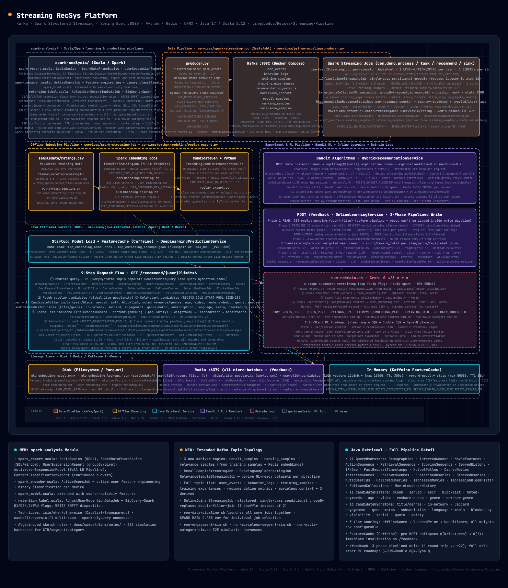

# Streaming Recsys Platform

`recsys-pipeline` is a recommendation-system playground organized around three pipelines:

- **Data pipeline** — Spark Structured Streaming jobs that ingest Kafka click and behavior events, join impressions with feedback into feature+label training samples, train Item2Vec and ALS embeddings from historical ratings, and keep per-user history and global item popularity fresh in Redis.
- **Model prediction pipeline** — A Spring Boot retrieval service that loads pre-trained ONNX models and embedding configs at startup, combines offline embedding scores with an online reward model, and serves ranked recommendations through a REST API.
- **Experiment pipeline** — A bandit-based evaluation layer (UCB, Thompson Sampling, Q-learning, SARSA) that tracks per-algorithm click-through and reward metrics, maintains a replay buffer for offline analysis, and supports hot-swapping model artifacts without redeployment.

## Service Layout

All independently runnable application code lives under `services/`:

| Service | Build tool | Responsibility |
|---|---|---|
| `services/spark-streaming-job` | sbt | Streaming ingestion, feature joins, offline embedding training, and candidate pre-computation |
| `services/java-retrieval-service` | Maven | Loads ONNX models and embedding configs at startup, scores candidates, runs bandit evaluation (UCB, Thompson, Q-learning, SARSA), and serves recommendations via REST |
| `services/python-modeling` | pip / pytest | Synthetic event producer, MovieLens two-tower training, ONNX model export, and evaluation utilities |

Infrastructure, shared sample data, and orchestration scripts remain at the `recsys-pipeline` root.

## Architecture



> Interactive version: [recsys-streaming-pipeline.html](recsys-streaming-pipeline-architecture.html)


### Data Pipeline

```text
── Streaming features ───────────────────────────────────────────────────────────────────────

producer.py ──(user_id key)──► Kafka: user_events ──► UserEventStreamingJob ──► Redis user:{id}:recent  (TTL 7d)
                                                                              └──► Redis global:item_popularity

producer.py ──(request_id key)► Kafka: behavior_logs ──► OnlineJoinerStreamingJob ──► Kafka: training_samples
                                                                                   └──► Parquet training-samples/date=YYYY-MM-DD/

Kafka: training_samples     ──► ExperienceCollectorStreamingJob  ──► Kafka: training_experiences
Kafka: training_experiences ──► RecommendationResponseStatsJob   ──► Kafka: recommendation_metrics
Kafka: movielens_context    ──► MovieLensContextCollectorStreamingJob ──► Redis user/movie context

── Offline embeddings ───────────────────────────────────────────────────────────────────────

ratings.csv ──► ItemSequencePreprocessingJob ──► Item2VecTrainingJob ──► embedding.txt
                                                                     └──► Redis i2vEmb:{item}

ratings.csv + embedding.txt ──► UserEmbeddingTrainingJob ──► user_embedding.txt
ratings.csv                 ──► AlsEmbeddingTrainingJob  ──► als/userFactors + als/itemFactors

user_embedding.txt + item_embedding.txt ──► EmbeddingCandidateGenerationJob ──► Redis user:{id}:candidates  (top-K cosine)
                                                                             └──► Parquet candidate-generation/
```

### Derived ML Datasets

All three jobs below consume `training_samples` (the OnlineJoiner output, which now carries
`session_id` end-to-end) and emit one row per recommended impression to a new Kafka topic. They
are additive — no existing topic/schema changed — and run standalone via `run-streaming-job.sh`.

```text
Kafka: training_samples ──► RecallSampleStreamingJob     ──► Kafka: recall_samples
Kafka: training_samples ──► RankingSampleStreamingJob    ──► Kafka: ranking_samples     (+ Redis uEmb/i2vEmb)
Kafka: training_samples ──► RelevanceSampleStreamingJob  ──► Kafka: relevance_samples   (+ Redis movie:{id}:features)
```

| Job | Topic | Row schema |
|---|---|---|
| `RecallSampleStreamingJob` | `recall_samples` | `user_id`, `session_id`, `event_ts`, `recommended_movie_id`, `click_movie_id` (null unless clicked), `rating` (label) |
| `RankingSampleStreamingJob` | `ranking_samples` | + `user_features`/`item_features` maps, `user_embedding` (`uEmb:{user}`), `item_embedding` (`i2vEmb:{item}`), `is_click`, `rating` |
| `RelevanceSampleStreamingJob` | `relevance_samples` | LTR shape: `query` (`user_id:session_id`), `recommended_movie_id`, `title`/`genres`/`release_year` (from `movie:{id}:features`), `score` (label) |

`rating`/`score` is the implicit engagement label (click → 1.0, order → 2.0, else 0.0). The ranking
and relevance jobs join Redis per micro-batch (embeddings / movie metadata); missing keys yield an
empty vector / null fields. Env knobs: `{RECALL,RANKING,RELEVANCE}_INPUT_TOPIC` (default
`training_samples`), `{RECALL,RANKING,RELEVANCE}_OUTPUT_TOPIC`, and (ranking) `USER_EMBEDDING_PREFIX`
/ `ITEM_EMBEDDING_PREFIX`.

```bash
SPARK_MAIN_CLASS=com.demo.process.RankingSampleStreamingJob ./run-streaming-job.sh
```

### Model Prediction Pipeline

```text
movielens_pipeline.py ──► two-tower retrieval + transformer ranking ──► sampledata/*.onnx

sampledata/*.onnx ──────────────────────────────────────────────┐
Redis: embeddings, user history, candidate lists ───────────────┼──► java-retrieval-service  (FeatureCache / Caffeine)
Redis: reward stats, bandit counters ───────────────────────────┘          │
                                                                            ├──► GET  /recommend/{user}
                                                                            ├──► GET  /embedding/{item}
                                                                            └──► GET  /predict/{user}/{item}
```

### Experiment Pipeline

```text
GET /recommend/{user} ──► bandit arm selection ──► impression logged → Redis bandit:metrics:{algo}
                           UCB | Thompson |
                           Q-learning | SARSA

POST /feedback ──► online reward update ──► Redis reward-model:{item|genre|tag|global}
               └──► Redis replay:recommendations  (replay buffer)
                             │
                             ▼
                    run-retrain.sh ──► retrain embeddings + model ──► POST /actuator/model-reload  (hot-swap)

GET /metrics ──► cross-algorithm comparison  (UCB vs Thompson vs Q-learning vs SARSA)
```

## Spark Job Package Structure

| Package | Responsibility | Examples |
|---|---|---|
| `com.demo.process` | Transform, join, and label stream/batch data into training samples; derive recall/ranking/relevance datasets | `OnlineJoinerStreamingJob`, `ExperienceCollectorStreamingJob`, `RecommendationResponseStatsJob`, `MovieLensContextCollectorStreamingJob`, `RecallSampleStreamingJob`, `RankingSampleStreamingJob`, `RelevanceSampleStreamingJob`, `ItemSequencePreprocessingJob` |
| `com.demo.task` | Runnable entry points for streaming ingestion and offline embedding training | `UserEventStreamingJob`, `Item2VecTrainingJob`, `UserEmbeddingTrainingJob`, `AlsEmbeddingTrainingJob` |
| `com.demo.recommend` | Offline candidate pre-computation from trained embeddings | `EmbeddingCandidateGenerationJob` |
| `com.demo.sink` | External write helpers | `RedisWriter` |
| `com.demo.util` | Shared Spark session and environment utilities | `Env`, `SparkSessions` |

## Scoring Model Architecture

Candidate items are scored through three stages, each with a different learning paradigm:

| Model type | Class | Signal | Update cadence |
|---|---|---|---|
| **Offline** | `DeepLearningPredictionService` | ONNX MLP score for a (user, item) pair | At training time; static at serve time |
| **Two-tower** | `TwoTowerPredictionService` | User-tower + item-tower cosine score re-ranked by a transformer; enabled via `ONNX_USER_TOWER_PATH` | At training time; hot-reloaded via `POST /actuator/model-reload` |
| **Online** | `OnlineLearningService` | Weighted mean reward per item, genre, tag, and global prior | After every `/feedback` call |
| **Bandit / RL** | `HybridRecommendationService` | UCB, Thompson Sampling, Q-learning, or SARSA score from replay state/action/reward events | After impressions and `/feedback` rewards |

All paths share the same `offlineScore` and `learnedPrior` base. The final `banditScore` diverges by algorithm:

```
offlineScore  = relevanceWeight × cosine(userEmb, itemEmb)
              + contentWeight   × genreTagOverlap
              + popularityWeight × normalizedPopularity
              + deepLearningWeight × onnxScore

learnedPrior  = offlineScore × (1 − onlineWeight) + onlineScore × onlineWeight

── UCB / Thompson ────────────────────────────────────────────────
banditScore   = BetaPosteriorMean(learnedPrior, clicks, impressions)
              + explorationBonus(UCB | Thompson)

── Q-learning / SARSA ───────────────────────────────────────────
banditScore   = Q(stateKey, item)   ← tabular Q-value in Redis, updated via Bellman equation
```

## Storage Architecture

Feature data is split across three tiers by access pattern and update frequency.

| Tier | Contents | Updated by |
|------|----------|------------|
| **Disk** (filesystem) | ONNX model (`mlp_embedding_model.onnx`), ID lookup tables (`mlp_embedding_lookups.json`), two-tower ONNX models (`movielens_user_tower.onnx`, `movielens_item_tower.onnx`, `movielens_ranking.onnx`), Parquet training samples partitioned by date | Training jobs; swappable at runtime via `ONNX_MODEL_PATH` without JAR rebuild |
| **Redis** | User click history, global item popularity, item/user embeddings (`i2vEmb:*`, `uEmb:*`, `alsItemEmb:*`, `alsUserEmb:*`, `twoTowerItemEmb:*`), bandit counters, reward model stats, replay buffer | Streaming jobs (each micro-batch) and `/feedback` calls |
| **In-memory** (Caffeine) | Item vectors (`i2vEmb:*`), reward model stats (`reward-model:*`) | Populated from Redis on first request; TTL-expired; invalidated on `/feedback` writes |

The in-memory cache (`FeatureCache`) eliminates O(N × features) Redis round-trips per recommendation request. Before the scoring loop, a single `MGET` loads all candidate and recent-item vectors; reward model estimates are cached per key for the configured TTL and invalidated immediately when `/feedback` updates them.

**Disk model hot-swap** — set `ONNX_MODEL_PATH` and `ONNX_LOOKUPS_PATH` to replace the MLP model artifacts on the filesystem without rebuilding the JAR. The service falls back to classpath resources when the env vars are unset (the development and test default). To enable the two-tower scoring path, set `ONNX_USER_TOWER_PATH`, `ONNX_ITEM_TOWER_PATH`, and `ONNX_RANKING_PATH` to the three ONNX files exported by `movielens_pipeline.py`.

## Recommendation Request Flow

For each incoming request, the retrieval service executes nine steps in order:

1. **Hydrate query** — 21 `QueryHydrator` implementations populate `ScoredMoviesQuery` with per-user context: watch history, rating sequences, social graph, served history, MinHash, cached candidates, bloom filter, geo, demographics, and inferred signals.
2. **Fetch popular candidates** — pulls top items from `global:item_popularity`.
3. **Generate cold-start candidates** — adds extra candidates from the configured catalog for users or items with no exposure history.
4. **Filter** — `CandidateFilter` drops seen, blocked, muted, and otherwise ineligible candidates.
5. **Hydrate candidates** — `CandidateHydrator` enriches surviving candidates with engagement counts, in-network signals, MinHash Jaccard similarity, and visibility flags.
6. **Score** — combines all three scoring stages: offline ONNX score, online reward-model estimate, and bandit arm score (see [Scoring Model Architecture](#scoring-model-architecture)).
7. **Randomize** — shuffles the top scoring pool slightly to avoid deterministic repetition.
8. **Store context** — writes pending recommendation context to the replay buffer for downstream training.
9. **Track metrics** — records impressions, clicks, regret-style metrics, novelty, and catalog coverage.

Default catalog and ranking weights are in `services/java-retrieval-service/src/main/resources/application.yml`.

## Quick Start

**Prerequisites:** Java 17, Apache Spark 3.5.x (Scala 2.12), sbt, Maven 3.8+, Docker Compose, Python 3.

The five steps below bring up the full stack: offline embeddings → retrieval service → clickstream producer → streaming job → API.

Build the Spark job JAR (run from the repo root):

```bash
(cd services/spark-streaming-job && sbt assembly)
```

Start Kafka, Zookeeper, and Redis:

```bash
docker compose up -d
```

### Step 1 — Offline embeddings

> Run once before starting the retrieval service.

Train Item2Vec embeddings and write them to Redis (`i2vEmb:{itemId}` keys):

```bash
RATINGS_INPUT_PATH=sampledata/ratings.csv \
ITEM2VEC_SAVE_TO_REDIS=true \
REDIS_HOST=localhost \
./run-offline-pipeline.sh
```

Train user embeddings from the item vectors above and write to Redis (`uEmb:{userId}` keys):

```bash
RATINGS_INPUT_PATH=sampledata/ratings.csv \
ITEM2VEC_EMBEDDING_PATH=sampledata/item_embedding.txt \
USER_EMBEDDING_SAVE_TO_REDIS=true \
REDIS_HOST=localhost \
./run-user-embedding-pipeline.sh
```

**Optional** — train ALS collaborative-filtering embeddings (`alsItemEmb:*`, `alsUserEmb:*`):

```bash
RATINGS_INPUT_PATH=sampledata/ratings.csv \
ALS_SAVE_TO_REDIS=true \
REDIS_HOST=localhost \
./run-als-pipeline.sh
```

To use ALS embeddings instead, set these before starting the retrieval service:

```bash
export ITEM_EMBEDDING_PREFIX=alsItemEmb
export USER_EMBEDDING_PREFIX=alsUserEmb
```

### Step 2 — Start the retrieval service

```bash
mvn -f services/java-retrieval-service/pom.xml spring-boot:run
```

The service loads `mlp_embedding_model.onnx` from the classpath at startup. To use a model trained outside the JAR, set `ONNX_MODEL_PATH` and `ONNX_LOOKUPS_PATH` before starting.

### Step 3 — Start the clickstream producer

```bash
pip install -r services/python-modeling/requirements.txt
python services/python-modeling/producer.py
```

### Step 4 — Run the streaming job

```bash
./run-streaming-job.sh
```

This populates `user:{id}:recent` and `global:item_popularity` in Redis in real time; the retrieval service uses both for recency and popularity signals.

### Step 5 — Query the API

```bash
curl http://localhost:8080/recommend/user_1
curl http://localhost:8080/recommend/user_1?limit=10
curl http://localhost:8080/metrics
```

**Standalone alternative** — run the Python two-stage pipeline (two-tower retrieval + transformer ranking) without Spark or the Java service:

```bash
pip install torch onnx onnxruntime numpy
python services/python-modeling/movielens_pipeline.py
```

The first run trains and exports the three ONNX models; later runs reuse them. Optional flags:

```bash
python services/python-modeling/movielens_pipeline.py --user alice --top-k 5
python services/python-modeling/movielens_pipeline.py --user alice --user bob
python services/python-modeling/movielens_pipeline.py --force-train --model-dir /tmp/movielens-models

# Train from a real ratings CSV instead of the built-in synthetic catalog:
python services/python-modeling/movielens_pipeline.py \
    --ratings-csv sampledata/ratings.csv \
    --force-train

# Train, then write item embeddings to Redis (enables TwoTowerPredictionService):
python services/python-modeling/movielens_pipeline.py \
    --ratings-csv sampledata/ratings.csv \
    --save-embeddings-to-redis \
    --redis-host localhost
```

Run the cross-service integration tests:

```bash
pytest -q
```

## Automated Retraining

The `run-retrain.sh` script runs a full retraining pass and hot-reloads the ONNX model into the running Java service. It chains five stages:

1. **Replay export** — reads `replay:recommendations` from Redis and writes `sampledata/replay_training.csv`
2. **Spark ALS** — regenerates ALS item/user embeddings and writes them to Redis
3. **Spark UserEmbedding** — regenerates weighted-average user vectors in Redis
4. **Python two-tower** — fine-tunes the two-tower model on the merged dataset and writes item embeddings to Redis under the `twoTowerItemEmb:*` prefix
5. **Model hot-reload** — calls `POST /actuator/model-reload` to swap the ONNX model in the running Java service without restart

### One-Off Run

```bash
./run-retrain.sh
```

### Scheduled Run (cron)

Use the install script to add a cron job on the host machine:

```bash
# Install — runs every 6 hours, logs to /var/log/recsys-retrain.log
./scripts/install-cron.sh

# Custom schedule (every day at 2 AM)
./scripts/install-cron.sh --schedule "0 2 * * *" --log /var/log/recsys-retrain.log

# Preview the crontab entry without writing it
./scripts/install-cron.sh --dry-run

# Remove the cron job
./scripts/install-cron.sh --uninstall
```

The script is idempotent — running it twice does not create duplicate entries. Verify the installed entry with `crontab -l`.

To add the entry manually instead:

```
0 */6 * * * cd /path/to/recsys-pipeline && ./run-retrain.sh >> /var/log/recsys-retrain.log 2>&1
```

### Skip Individual Stages

```bash
./run-retrain.sh --skip-spark          # Only Python + reload
./run-retrain.sh --skip-python         # Only Spark + reload
./run-retrain.sh --skip-reload         # Train without hot-reload (offline mode)
```

### Environment Variables

| Variable | Default | Description |
|----------|---------|-------------|
| `REDIS_HOST` | `localhost` | Redis server hostname |
| `REDIS_PORT` | `6379` | Redis server port |
| `RECSYS_SERVICE_URL` | `http://localhost:8080` | Java retrieval service URL |
| `RATINGS_CSV` | `sampledata/ratings.csv` | Base training data |
| `MODEL_DIR` | `sampledata` | ONNX output directory |
| `DRY_RUN` | `0` | Set to `1` to print steps without executing |

### Replay Buffer Export

The `replay:recommendations` Redis list is populated by `ExperienceCollectorStreamingJob`. Run `replay_export.py` standalone to inspect or back up the buffer:

```bash
python3 services/python-modeling/replay_export.py \
    --output /tmp/replay_backup.csv \
    --redis-host localhost
```

## API

### `GET /recommend/{user}?limit=6`

Returns recent interactions, selected recommendations, per-item diagnostics, and request-level metrics.

```json
{
  "user": "user_1",
  "recent": ["item_7", "item_2"],
  "recommendations": ["item_5", "item_4", "item_1"],
  "diagnostics": [
    {
      "item": "item_5",
      "estimatedReward": 0.71,
      "relevanceScore": 0.62,
      "contentScore": 0.67,
      "dlScore": 0.74,
      "rewardModelScore": 0.58,
      "explorationBonus": 0.19,
      "banditScore": 0.78,
      "coldStart": true,
      "impressions": 2,
      "clicks": 1
    }
  ],
  "metrics": {
    "algorithm": "ucb",
    "eligibleCandidateCount": 8,
    "randomizationPool": 5,
    "pseudoRegret": 0.04,
    "avgEstimatedReward": 0.68,
    "avgExplorationBonus": 0.12,
    "coldStartShare": 0.5,
    "catalogCoverage": 0.57
  }
}
```

- `limit` defaults to `6`, clamped to `1..50`.
- User and item IDs must match `[a-zA-Z0-9_:-]{1,64}`.

### `GET /predict/{user}/{item}`

Scores a single (user, item) pair using the offline ONNX model. Returns an error if either ID is not in the model's lookup table.

```bash
curl http://localhost:8080/predict/user_1/item_5
```

```json
{"model":"mlp_embedding","user":"user_1","item":"item_5","userId":0,"itemId":4,"score":0.742}
```

### `GET /predict/id?userId=0&itemId=4`

Same as above but accepts raw integer lookup IDs directly.

### `GET /predict/metadata`

Returns model name, lookup table sizes, and ONNX input/output names for the loaded offline model.

### `POST /feedback`

Records user feedback for an exposed item. All Redis writes are batched in a single `executePipelined` call (one round-trip instead of ~22). The three phases on each call:

1. **Read** — fetch the pending replay context written at serve time (`GET replay:pending:{user}:{item}`). Must happen before the pipeline because reads cannot be issued inside a write pipeline.
2. **Write (pipelined)** — batch all writes in one flush:
   - Increment bandit click counter and per-algorithm metrics hashes.
   - Update online reward stats for the item, its genres, its tags, and the global prior (`HINCRBY` on `reward-model:*` hashes).
   - Push the rewarded event to the replay buffer (`RPUSH` + `LTRIM`).
3. **Invalidate** — purge affected `reward-model:*` keys from the Caffeine in-memory cache so the next `/recommend` request reads fresh stats.

```bash
curl -X POST http://localhost:8080/feedback \
  -H 'Content-Type: application/json' \
  -d '{"user":"user_1","item":"item_5","clicked":true,"reward":1.0}'
```

### `GET /metrics`

Returns aggregate online metrics for the active algorithm and a per-algorithm comparison view.

| Field | Description |
|---|---|
| `requests` | Total recommendation requests served |
| `recommendationsServed` | Total items recommended |
| `clicks` | Total clicks recorded via `/feedback` |
| `ctr` | Click-through rate |
| `avgObservedReward` | Mean reward from `/feedback` calls |
| `avgEstimatedReward` | Mean predicted reward at serve time |
| `avgPseudoRegret` | Mean per-request regret estimate |
| `cumulativePseudoRegret` | Running sum of pseudo-regret |
| `avgNoveltyScore` | Mean novelty of served items |
| `coldStartImpressions` | Impressions on cold-start items |
| `exploratoryImpressions` | Impressions driven by exploration bonus |
| `catalogCoverage` | Fraction of catalog served at least once |
| `allAlgorithms.ucb` | Per-metric breakdown for UCB |
| `allAlgorithms.thompson` | Per-metric breakdown for Thompson Sampling |
| `global` | Aggregate across all algorithms |

Redis keys:

| Key | Scope |
|---|---|
| `bandit:metrics` | All traffic combined |
| `bandit:metrics:ucb` | UCB only |
| `bandit:metrics:thompson` | Thompson Sampling only |

### `GET /embedding/{item}`

Returns an item embedding from Redis using key `i2vEmb:{item}`.

## Real-Time Path

### `services/python-modeling/producer.py`

Publishes synthetic events to Kafka. In `clickstream` mode it writes simple click events keyed by `user_id`. In `behavior` mode it writes full impression/click/order slates keyed by `request_id`, which co-partitions all events in the same slate for the `OnlineJoinerStreamingJob` join. It uses lz4 compression; the event loop accounts for send latency so the configured rate is maintained accurately at high throughput.

Environment variables:

| Env var | Default | Description |
|---|---|---|
| `KAFKA_BOOTSTRAP_SERVERS` | `localhost:9092` | Kafka broker address |
| `KAFKA_TOPIC` | `user_events` | Kafka topic to publish to |
| `PRODUCER_MODE` | `clickstream` | `clickstream` emits single click events keyed by `user_id`; `behavior` emits full impression/click/order slates keyed by `request_id` |
| `EVENTS_PER_SECOND` | `1` | Target publish rate; the event loop corrects for send latency |
| `NUM_USERS` | `5` | Synthetic user pool size |
| `NUM_ITEMS` | `10` | Synthetic item pool size |
| `SLATE_SIZE` | `5` | Items per slate in `behavior` mode |
| `LOG_EVERY` | `100` | Log a summary line every N events |
| `MAX_EVENTS` | `0` | Stop after N events; `0` runs indefinitely |

`clickstream` mode event schema:

```json
{"user_id":"user_1","item_id":"item_3","event_type":"click","timestamp":1713600001}
```

`behavior` mode event schema:

```json
{
  "request_id": "req_abc123",
  "user_id": "user_1",
  "item_id": "item_3",
  "event_type": "impression",
  "timestamp": 1713600001,
  "position": 0,
  "user_features": {"tier": "vip"},
  "item_features": {"bucket": "b1"},
  "context_features": {"device": "ios", "country": "US"}
}
```

### `UserEventStreamingJob`

Consumes click events from Kafka and writes user click history and item popularity to Redis. Connection pooling uses a per-executor `JedisPool` (one pool per JVM, reused across micro-batches) rather than a new TCP connection per partition.

For each micro-batch, it:

1. Aggregates clicked items per user in a single pass.
2. Writes one `LPUSH` + `LTRIM` + `EXPIRE` per user to `user:{id}:recent` (not one write per event).
3. Aggregates per-item click counts.
4. Writes one `ZINCRBY` per unique item to `global:item_popularity`.

Redis keys written:

| Key | Type | Contents | TTL |
|---|---|---|---|
| `user:{id}:recent` | list | Most recent clicked items, newest first | `RECENT_ITEMS_TTL_SECONDS` (default 7 days) |
| `global:item_popularity` | sorted set | Global click counts | none |

Environment variables:

| Env var | Default |
|---|---|
| `SPARK_APP_NAME` | `UserEventStreamingJob` |
| `SPARK_MASTER` | `local[*]` |
| `SPARK_SQL_SHUFFLE_PARTITIONS` | `4` |
| `KAFKA_BOOTSTRAP_SERVERS` | `localhost:9092` |
| `KAFKA_TOPIC` | `user_events` |
| `REDIS_HOST` | `localhost` |
| `REDIS_PORT` | `6379` |
| `RECENT_ITEMS_LIMIT` | `20` |
| `RECENT_ITEMS_TTL_SECONDS` | `604800` (7 days) |
| `REDIS_PIPELINE_SIZE` | `500` |
| `REDIS_POOL_MAX_TOTAL` | `8` |
| `MAX_OFFSETS_PER_TRIGGER` | `5000` |
| `TRIGGER_INTERVAL` | `5 seconds` |
| `SPARK_CHECKPOINT_LOCATION` | `/tmp/spark-recsys/user-event-streaming-job` |

### `OnlineJoinerStreamingJob`

Joins impression events with later feedback from Kafka to produce labeled training samples (features + label).

Start the behavior-mode producer:

```bash
PRODUCER_MODE=behavior KAFKA_TOPIC=behavior_logs python services/python-modeling/producer.py
```

Start the joiner job:

```bash
SPARK_MAIN_CLASS=com.demo.process.OnlineJoinerStreamingJob \
ONLINE_JOINER_INPUT_TOPIC=behavior_logs \
ONLINE_JOINER_OUTPUT_TOPIC=training_samples \
ONLINE_JOINER_HDFS_OUTPUT_PATH=/tmp/spark-recsys/training-samples \
./run-streaming-job.sh
```

For each micro-batch, it:

1. Runs a **single-pass conditional `groupBy`** over `(request_id, user_id, item_id)`: impression/exposure rows contribute position, timestamp, and feature fields; click/order/purchase rows contribute feedback signals. Replaces the previous double-filter + join pattern — one shuffle and one scan instead of two each.
2. Drops groups with no impression in this batch (`impression_ts IS NULL`) — pure late-feedback events with no matching slate exposure.
3. Produces one sample per exposed item with `clicked`, `ordered`, and numeric `label` (`0.0` = not clicked, `1.0` = clicked, `2.0` = ordered).
4. Persists the joined samples (`MEMORY_AND_DISK_SER`) and writes to both sinks inside a `try/finally` that always unpersists.
5. Writes samples to Kafka for online model updates.
6. Writes samples to Parquet **partitioned by date** (`date=YYYY-MM-DD/`) for efficient incremental reads by downstream training jobs.

Environment variables:

| Env var | Default |
|---|---|
| `SPARK_APP_NAME` | `OnlineJoinerStreamingJob` |
| `ONLINE_JOINER_INPUT_TOPIC` | `behavior_logs` |
| `ONLINE_JOINER_OUTPUT_TOPIC` | `training_samples` |
| `ONLINE_JOINER_HDFS_OUTPUT_PATH` | `/tmp/spark-recsys/training-samples` |
| `SPARK_CHECKPOINT_LOCATION` | `/tmp/spark-recsys/online-joiner` |

### Session tracking

Each behavior slate carries a `session_id` (producers group 1..`SESSION_MAX_SLATES` slates per user
into a session). `OnlineJoinerStreamingJob` threads it through to `training_samples` (Kafka value +
Parquet), and `ExperienceCollectorStreamingJob` carries it into `training_experiences`. It is
additive and nullable. `services/python-modeling/session_report.py` aggregates session-level
engagement (sessions/user, slates/session, clicks/session, session CTR) from the Parquet.

### Event de-duplication (Phase 2)

`UserEventStreamingJob` and
`OnlineJoinerStreamingJob` drop duplicate `event_id`s within
`EVENT_WATERMARK_DELAY` (default `10 minutes`). Because this makes the queries
stateful, **existing checkpoints are incompatible** — on first deploy of this
change, point `SPARK_CHECKPOINT_LOCATION` at a fresh directory. Per-batch
`corrupt=<n>` counts are logged by the metrics listener.

### `ExperienceCollectorStreamingJob`

Consumes item-level training samples from Kafka and rebuilds each recommendation request as a list-level slate experience.

```bash
SPARK_MAIN_CLASS=com.demo.process.ExperienceCollectorStreamingJob \
EXPERIENCE_COLLECTOR_INPUT_TOPIC=training_samples \
EXPERIENCE_COLLECTOR_OUTPUT_TOPIC=training_experiences \
./run-streaming-job.sh
```

For each micro-batch, it groups samples by `(request_id, user_id)`, sorts items by `position`, and emits a slate JSON containing request context, item features, item labels, slate size, and aggregate slate reward.

Environment variables:

| Env var | Default |
|---|---|
| `SPARK_APP_NAME` | `ExperienceCollectorStreamingJob` |
| `EXPERIENCE_COLLECTOR_INPUT_TOPIC` | `training_samples` |
| `EXPERIENCE_COLLECTOR_OUTPUT_TOPIC` | `training_experiences` |
| `SPARK_CHECKPOINT_LOCATION` | `/tmp/spark-recsys/experience-collector` |

### `RecommendationResponseStatsJob`

Consumes request-level slates from `training_experiences` and emits global response metric events to Kafka. Per response, the job produces a total counter, a country-bucketed total counter, selected item/ad counts, and guardrail checks for empty or insufficiently populated responses.

```bash
SPARK_MAIN_CLASS=com.demo.process.RecommendationResponseStatsJob \
RESPONSE_STATS_INPUT_TOPIC=training_experiences \
RESPONSE_STATS_OUTPUT_TOPIC=recommendation_metrics \
./run-streaming-job.sh
```

Each metric payload contains:

| Field | Value |
|---|---|
| `metric_name` | `RecommendationFeed.response` |
| `tags` | `type`, `subscription`, optional `country`, optional `blender`, optional `stage` |
| `value` | Count for that response/stat |

Tag sources:

| Tag | Source field(s) | Notes |
|---|---|---|
| `type` | `item_features.type` or `item_features.product_type` | `ad`, `ads`, `sponsored` → ad; all others → item |
| `subscription` | `user_features.subscription_level` or `user_features.subscription` | |
| `country` | Context/user country fields | Bucketed |
| `blender` | `context_features.AdsBlenderType` or `context_features.ads_blender_type` | Optional |

Environment variables:

| Env var | Default |
|---|---|
| `SPARK_APP_NAME` | `RecommendationResponseStatsJob` |
| `RESPONSE_STATS_INPUT_TOPIC` | `training_experiences` |
| `RESPONSE_STATS_OUTPUT_TOPIC` | `recommendation_metrics` |
| `SPARK_CHECKPOINT_LOCATION` | `/tmp/spark-recsys/response-stats` |

### `MovieLensContextCollectorStreamingJob`

Consumes MovieLens user, movie, and rating context updates from Kafka and writes the Redis hashes used by the retrieval service query hydrators. Context events are normalized once in the streaming layer; the online service then reads compact per-user and per-movie feature state at request time.

```bash
SPARK_MAIN_CLASS=com.demo.process.MovieLensContextCollectorStreamingJob \
MOVIELENS_CONTEXT_INPUT_TOPIC=movielens_context \
./run-streaming-job.sh
```

For each micro-batch, it:

1. Classifies mixed JSON records as `user_update`, `movie_update`, or `rating`.
2. Merges user demographic fields and rating aggregates (`avgRating`, `ratingCount`, `recentlyRatedMovieIds`, `actionSequenceMovieIds`) into `user:{id}:features`.
3. Stores movie title, genres, and release year under `movie:{id}:features`.

Redis keys written:

| Key | Type | Contents | TTL |
|---|---|---|---|
| `user:{id}:features` | hash | MovieLens user demographics and rating context | `MOVIELENS_CONTEXT_TTL_SECONDS` (default 30 days) |
| `movie:{id}:features` | hash | Movie title, genres, release year | `MOVIELENS_CONTEXT_TTL_SECONDS` (default 30 days) |

Environment variables:

| Env var | Default |
|---|---|
| `SPARK_APP_NAME` | `MovieLensContextCollectorStreamingJob` |
| `MOVIELENS_CONTEXT_INPUT_TOPIC` | `movielens_context` |
| `REDIS_HOST` | `localhost` |
| `REDIS_PORT` | `6379` |
| `MOVIELENS_CONTEXT_TTL_SECONDS` | `2592000` (30 days) |
| `MOVIELENS_RECENT_RATINGS_LIMIT` | `50` |
| `REDIS_PIPELINE_SIZE` | `500` |
| `REDIS_POOL_MAX_TOTAL` | `8` |
| `MAX_OFFSETS_PER_TRIGGER` | `5000` |
| `TRIGGER_INTERVAL` | `10 seconds` |
| `SPARK_CHECKPOINT_LOCATION` | `/tmp/spark-recsys/movielens-context-collector` |

## Retrieval Pipeline

Before scoring, each request is enriched through two sequential pipelines.

### Query Hydration

`QueryHydrator<ScoredMoviesQuery>` implementations populate per-user context fields on the incoming request. Each hydrator reads one concern and writes one field group; hydrators run independently and can be parallelized.

| Hydrator | Field(s) hydrated | Source |
|---|---|---|
| `UserDemographicsQueryHydrator` | `demographics` | `MovieLensFeatureClient` (`user:{id}:features`) |
| `UserInferredGenderQueryHydrator` | `inferredGender`, `inferredGenderScore` | `MovieLensFeatureClient`; falls back to `demographics.gender` for new users (ratingCount == 0) |
| `UserMovieFeaturesQueryHydrator` | rating-based features | `MovieLensFeatureClient` |
| `UserActionSequenceQueryHydrator` | `actionSequenceMovieIds` (dedup + truncate to 50) | `MovieLensFeatureClient` (field: `recentlyRatedMovieIds`) |
| `RetrievalSequenceQueryHydrator` | `retrievalSequenceMovieIds` (dedup + truncate to 100) | `UserActionAggregationClient` (`user:{id}:features` via dedup pipeline) |
| `ScoringSequenceQueryHydrator` | `scoringSequenceMovieIds` (dedup + truncate to 20) | `UserActionAggregationClient` |
| `ServedHistoryQueryHydrator` | `servedMovieIds` | `ServedHistoryClient` (`user:{id}:served_history`) |
| `IpQueryHydrator` | `ipLocation` (ZIP code proxy) | `GeoLocationClient` (`user:{id}:features`) |
| `PastRequestTimestampsQueryHydrator` | `pastRequestTimestamps` | `PastRequestTimestampsClient` (`user:{id}:request_history`) |
| `MutualFollowQueryHydrator` | `mutualFollowMinhash` | `SimilarityMinHashClient` (`user:{id}:minhash`) |
| `CachedMoviesQueryHydrator` | `cachedMovieIds`, `hasCachedMovies` | `CachedMoviesClient` (`user:{id}:cached_movies`) |
| `InferredGenresQueryHydrator` | `inferredGenres` (genre preference signal) | `MovieLensFeatureClient` |
| `FollowedGenresQueryHydrator` | `followedGenres` (followed genre IDs) | `MovieLensFeatureClient` |
| `SubscribedUserIdsQueryHydrator` | `subscribedUserIds` | `SocialGraphClient` (`user:{id}:social`) |
| `BlockedUserIdsQueryHydrator` | `blockedUserIds` | `SocialGraphClient` |
| `MutedUserIdsQueryHydrator` | `mutedUserIds` | `SocialGraphClient` |
| `FollowedUserIdsQueryHydrator` | `followedUserIds` | `SocialGraphClient` |
| `ImpressedMoviesQueryHydrator` | `impressedMovieIds` | `ImpressedMoviesClient` (`user:{id}:impressions`) |
| `ImpressionBloomFilterQueryHydrator` | `impressionBloomFilter` | `ImpressionBloomFilterClient` (`user:{id}:bloom_filter`) |
| `FollowedCollectionsQueryHydrator` | `followedCollections` | `FollowedStarterPacksClient` (`user:{id}:starter_packs`) |
| `MovieLensUserHistoryQueryHydrator` | `watchedMovieIds`, `ratedMovieIds` | `UserMovieHistoryClient` (`user:{id}:history`) |

All client classes live under `com.demo.retrieval.service.clients`. `MovieLensFeatureClient` covers the general rating-and-demographics feature store. `SocialGraphClient` covers block/mute/follow/subscribe relationships (different write path); all other clients own a dedicated Redis key namespace.

### Candidate Filters and Hydrators

After initial candidate generation, candidates pass through two more pipelines.

**Filters** (`CandidateFilter`) drop ineligible candidates:

| Filter | Removes |
|---|---|
| `PreviouslySeenMoviesFilter` | Movies the user has already watched (via bloom filter) |
| `PreviouslySeenMoviesBackupFilter` | Watched movies using `impressedMovieIds`; used when bloom filter is unavailable |
| `PreviouslyServedMoviesFilter` | Recently served movies (`servedMovieIds`) |
| `SelfMovieFilter` | Movies created by the requesting user (`userId == ownerId`) |
| `CreatorBlocklistFilter` | Movies from blocked creators |
| `MutedKeywordFilter` | Movies whose title or tags match muted keywords |
| `AgeFilter` | Movies outside the user's age-appropriate range |
| `VideoFilter` | Non-video content (configurable via filter settings) |
| `ReshareDeduplicationFilter` | Duplicate reshares of the same source movie |
| `GenreIdsFilter` | Candidates not matching the requested genre IDs |
| `NewUserGenreFilter` | Candidates outside the genre allowlist for new users |

**Candidate hydrators** (`CandidateHydrator`) enrich surviving candidates with additional signals:

| Hydrator | Adds |
|---|---|
| `CoreDataCandidateHydrator` | Title, genres, and release year from the movie feature store |
| `InNetworkCandidateHydrator` | In-network flag — whether the candidate is from a followed creator |
| `MutualFollowJaccardCandidateHydrator` | Jaccard similarity score via MinHash |
| `EngagementCountsCandidateHydrator` | Global rating count and average rating |
| `GenreMatchCandidateHydrator` | Genre overlap signal against user preferences |
| `SubscriptionCandidateHydrator` | Subscription-gated content flag |
| `LanguageCodeCandidateHydrator` | Language code |
| `HasMediaCandidateHydrator` | Media type flags |
| `BlockedByCandidateHydrator` | Blocked-by flag — whether the viewer is blocked by the candidate's creator |
| `VisibilityFilteringCandidateHydrator` | Visibility eligibility flag based on content policy |
| `FollowingRepliedUsersCandidateHydrator` | Social proximity signal from followed or replied-to creators |
| `QuoteCandidateHydrator` | Quote and reference metadata |
| `GizmoduckCandidateHydrator` | External content safety signal |

## Retrieval Service Configuration

`services/java-retrieval-service/src/main/resources/application.yml` defines Redis connectivity, in-memory cache settings, and recommendation parameters under `recsys`.

### Disk model paths

Set these to load model artifacts from the filesystem instead of the bundled classpath resources. When unset, falls back to classpath (the development and test default).

**MLP model** (`DeepLearningPredictionService`):

| Env var | Default | Description |
|---|---|---|
| `ONNX_MODEL_PATH` | *(classpath)* | Absolute path to `mlp_embedding_model.onnx` on the filesystem |
| `ONNX_LOOKUPS_PATH` | *(classpath)* | Absolute path to `mlp_embedding_lookups.json` on the filesystem |

**Two-tower model** (`TwoTowerPredictionService` — disabled unless all three are set):

| Env var | Default | Description |
|---|---|---|
| `ONNX_USER_TOWER_PATH` | *(unset)* | Absolute path to `movielens_user_tower.onnx` exported by `movielens_pipeline.py` |
| `ONNX_ITEM_TOWER_PATH` | *(unset)* | Absolute path to `movielens_item_tower.onnx` |
| `ONNX_RANKING_PATH` | *(unset)* | Absolute path to `movielens_ranking.onnx` (transformer re-ranker) |

### In-memory cache (FeatureCache)

| Property | Env var | Default | Description |
|---|---|---|---|
| `recsys.cache.item-vector-max-size` | `RECSYS_ITEM_VECTOR_CACHE_SIZE` | `10000` | Maximum cached item vectors |
| `recsys.cache.item-vector-ttl-seconds` | `RECSYS_ITEM_VECTOR_TTL` | `300` | Item vector TTL (seconds); matches training job cadence |
| `recsys.cache.reward-max-size` | `RECSYS_REWARD_CACHE_SIZE` | `50000` | Maximum cached reward model stat entries |
| `recsys.cache.reward-ttl-seconds` | `RECSYS_REWARD_TTL` | `30` | Reward model stat TTL; invalidated immediately on `/feedback` writes |

### Recommendation properties

**Embeddings**

| Property | Default |
|---|---|
| `recsys.embeddings.item-prefix` | `i2vEmb` |
| `recsys.embeddings.user-prefix` | `uEmb` |

**Candidate generation**

| Property | Default |
|---|---|
| `recsys.candidate-generation.popularity-fetch-multiplier` | `5` |
| `recsys.candidate-generation.cold-start-pool-size` | `25` |
| `recsys.candidate-generation.top-n-randomization-pool` | `5` |

**Filtering**

| Property | Default |
|---|---|
| `recsys.filtering.enabled` | `true` |
| `recsys.filtering.blocked-users` | *(empty)* |
| `recsys.filtering.muted-product-types` | *(empty)* |
| `recsys.filtering.muted-genres` | *(empty)* |
| `recsys.filtering.muted-keywords` | *(empty)* |

**Bandit**

| Property | Default |
|---|---|
| `recsys.bandit.algorithm` | `ucb` |
| `recsys.bandit.exploration-alpha` | `0.75` |
| `recsys.bandit.max-exploration-bonus` | `0.25` |
| `recsys.bandit.cold-start-exposure-threshold` | `5` |
| `recsys.bandit.cold-start-boost` | `1.35` |
| `recsys.bandit.relevance-weight` | `0.6` |
| `recsys.bandit.content-weight` | `0.25` |
| `recsys.bandit.popularity-weight` | `0.15` |
| `recsys.bandit.deep-learning-weight` | `0.0` |
| `recsys.bandit.q-learning-alpha` | `0.1` |
| `recsys.bandit.q-learning-gamma` | `0.9` |
| `recsys.bandit.q-learning-epsilon` | `0.1` |

**Replay buffer**

| Property | Default |
|---|---|
| `recsys.replay-buffer.max-size` | `10000` |
| `recsys.replay-buffer.candidate-snapshot-size` | `20` |

**Reward model**

| Property | Default |
|---|---|
| `recsys.reward-model.weight` | `0.25` |
| `recsys.reward-model.global-weight` | `0.15` |
| `recsys.reward-model.item-weight` | `0.45` |
| `recsys.reward-model.genre-weight` | `0.25` |
| `recsys.reward-model.tag-weight` | `0.15` |
| `recsys.reward-model.min-feature-count` | `3` |

Runtime overrides:

**Infrastructure**

| Env var | Default |
|---|---|
| `REDIS_HOST` | `localhost` |
| `REDIS_PORT` | `6379` |
| `SERVER_PORT` | `8080` |

**Embeddings**

| Env var | Default |
|---|---|
| `ITEM_EMBEDDING_PREFIX` | `i2vEmb` |
| `USER_EMBEDDING_PREFIX` | `uEmb` |

**Candidate generation**

| Env var | Default |
|---|---|
| `RECSYS_POPULARITY_FETCH_MULTIPLIER` | `5` |
| `RECSYS_COLD_START_POOL_SIZE` | `25` |
| `RECSYS_RANDOMIZATION_POOL` | `5` |

**Bandit**

| Env var | Default |
|---|---|
| `RECSYS_BANDIT_ALGORITHM` | `ucb` |
| `RECSYS_EXPLORATION_ALPHA` | `0.75` |
| `RECSYS_MAX_EXPLORATION_BONUS` | `0.25` |
| `RECSYS_COLD_START_THRESHOLD` | `5` |
| `RECSYS_COLD_START_BOOST` | `1.35` |
| `RECSYS_RELEVANCE_WEIGHT` | `0.6` |
| `RECSYS_CONTENT_WEIGHT` | `0.25` |
| `RECSYS_POPULARITY_WEIGHT` | `0.15` |
| `RECSYS_DEEP_LEARNING_WEIGHT` | `0.0` |

**Replay buffer**

| Env var | Default |
|---|---|
| `RECSYS_REPLAY_BUFFER_MAX_SIZE` | `10000` |
| `RECSYS_REPLAY_CANDIDATE_SNAPSHOT_SIZE` | `20` |

**Reward model**

| Env var | Default |
|---|---|
| `RECSYS_REWARD_MODEL_WEIGHT` | `0.25` |
| `RECSYS_REWARD_GLOBAL_WEIGHT` | `0.15` |
| `RECSYS_REWARD_ITEM_WEIGHT` | `0.45` |
| `RECSYS_REWARD_GENRE_WEIGHT` | `0.25` |
| `RECSYS_REWARD_TAG_WEIGHT` | `0.15` |
| `RECSYS_REWARD_MIN_FEATURE_COUNT` | `3` |

**In-memory cache**

| Env var | Default |
|---|---|
| `RECSYS_ITEM_VECTOR_CACHE_SIZE` | `10000` |
| `RECSYS_ITEM_VECTOR_TTL` | `300` |
| `RECSYS_REWARD_CACHE_SIZE` | `50000` |
| `RECSYS_REWARD_TTL` | `30` |

**Disk model**

| Env var | Default |
|---|---|
| `ONNX_MODEL_PATH` | *(classpath fallback)* |
| `ONNX_LOOKUPS_PATH` | *(classpath fallback)* |

### Bandit algorithm notes

All four algorithms consume the same `learnedPrior` — a blend of `offlineScore` (static signals + ONNX) and `onlineScore` (real-time reward model) — so bandit updates refine rather than replace the base ranker.

- **`ucb`** — builds a Beta-smoothed posterior mean for each item, then adds a confidence term proportional to `sqrt(log(total_impressions) / pulls)`.
- **`thompson`** — builds the same posterior and ranks items by sampling from the Beta posterior, giving a stochastic arm draw per request.
- **`q-learning`** — stores tabular Q-values in Redis under `q-learning:q:{stateKey}` and updates from feedback with `Q(s,a) += alpha * (reward + gamma * max_a Q(s',a) - Q(s,a))`.
- **`sarsa`** — stores tabular Q-values under `sarsa:q:{stateKey}` and updates with the on-policy target `reward + gamma * Q(s', a')`, where `a'` is selected by the same epsilon-greedy policy used for serving.

Set `RECSYS_DEEP_LEARNING_WEIGHT` to a non-zero value to enable the ONNX model's contribution to `offlineScore`. Weights do not need to sum to `1.0`; scores are clamped to `[0, 1]` at each stage.

Switch algorithms by setting `RECSYS_BANDIT_ALGORITHM` to `ucb`, `thompson`, `q-learning`, or `sarsa`.

### Real-time training write path

`/feedback` triggers online learning by updating reward statistics in Redis for the item, its genres, tags, and a global prior. Before batching, this was ~22 individual round-trips per feedback call. The current implementation collapses all writes into one:

```
GET  replay:pending:{user}:{item}           ← phase 1: read (before pipeline)
──────────────────────── pipeline (phase 2: write) ─────────────────────────
HINCRBY bandit:metrics clicks 1             ← if clicked
HINCRBY bandit:metrics:{algo} clicks 1
INCR    bandit:item:{item}:clicks
HINCRBY bandit:metrics reward_total {r}
HINCRBY bandit:metrics:{algo} reward_total {r}
HINCRBY reward-model:global count 1         ← online learning update
HINCRBY reward-model:global reward_total {r}
HINCRBY reward-model:item:{item} count 1
HINCRBY reward-model:item:{item} reward_total {r}
HINCRBY reward-model:genre:{g} ...          ← one pair per genre
HINCRBY reward-model:tag:{t} ...            ← one pair per tag
RPUSH   replay:recommendations {payload}    ← replay buffer
LTRIM   replay:recommendations -{max} -1
─────────────────────────────── flush ──────────────────────────────────────
featureCache.invalidateRewardStats(...)     ← phase 3: local cache purge
```

Replay and reward-model Redis keys:

| Key | Type | Contents |
|---|---|---|
| `replay:pending:{user}:{item}` | string | Last recommendation context for a served user-item pair |
| `replay:recommendations` | list | Rewarded replay events from `/feedback` |
| `reward-model:global` | hash | Global count and reward total |
| `reward-model:item:{item}` | hash | Per-item count and reward total |
| `reward-model:genre:{genre}` | hash | Per-genre count and reward total |
| `reward-model:tag:{tag}` | hash | Per-tag count and reward total |

## Offline Path

### `ItemSequencePreprocessingJob`

Builds time-ordered item sequences from ratings where `rating >= 3.5`.

```bash
spark-submit \
  --class com.demo.process.ItemSequencePreprocessingJob \
  services/spark-streaming-job/target/scala-2.12/spark-recsys-job.jar \
  sampledata/ratings.csv \
  /tmp/spark-recsys/item-sequences
```

Environment variables:

| Env var | Description |
|---|---|
| `RATINGS_INPUT_PATH` | Path to the ratings CSV; overrides the first positional argument |
| `ITEM_SEQUENCES_OUTPUT_PATH` | Output directory for item sequences; overrides the second positional argument |

### `Item2VecTrainingJob`

Trains Spark MLlib `Word2Vec` on item sequences, writes item embeddings to a text file, and optionally publishes them to Redis for the retrieval service.

```bash
spark-submit \
  --class com.demo.task.Item2VecTrainingJob \
  services/spark-streaming-job/target/scala-2.12/spark-recsys-job.jar \
  sampledata/ratings.csv \
  sampledata/embedding.txt \
  item_1
```

Key environment variables:

| Env var | Default |
|---|---|
| `RATINGS_INPUT_PATH` | *(positional arg)* |
| `ITEM2VEC_EMBEDDING_PATH` | `recsys-pipeline/sampledata/embedding.txt` |
| `ITEM2VEC_QUERY_ITEM` | `592` |
| `ITEM2VEC_REDIS_KEY_PREFIX` | `i2vEmb` |
| `ITEM2VEC_REDIS_TTL_SECONDS` | `86400` (1 day) |
| `ITEM2VEC_MIN_COUNT` | `1` |
| `ITEM2VEC_SAVE_TO_REDIS` | `false` |

Train and publish embeddings to Redis:

```bash
ITEM2VEC_SAVE_TO_REDIS=true \
REDIS_HOST=localhost \
REDIS_PORT=6379 \
spark-submit \
  --class com.demo.task.Item2VecTrainingJob \
  services/spark-streaming-job/target/scala-2.12/spark-recsys-job.jar \
  sampledata/ratings.csv \
  sampledata/embedding.txt \
  item_1
```

Output format:

```text
item_1:0.0123 -0.4567 0.8910 ...
```

### `UserEmbeddingTrainingJob`

Builds a user embedding by averaging item vectors for ratings at or above `USER_EMBEDDING_MIN_RATING` (default `3.5`).

```bash
spark-submit \
  --class com.demo.task.UserEmbeddingTrainingJob \
  services/spark-streaming-job/target/scala-2.12/spark-recsys-job.jar \
  sampledata/ratings.csv \
  sampledata/item_embedding_sample.txt \
  sampledata/user_embedding.txt
```

Key environment variables:

| Env var | Default |
|---|---|
| `RATINGS_INPUT_PATH` | *(positional arg)* |
| `ITEM2VEC_EMBEDDING_PATH` | *(positional arg)* |
| `USER_EMBEDDING_OUTPUT_PATH` | `recsys-pipeline/sampledata/user_embedding.txt` |
| `USER_EMBEDDING_MIN_RATING` | `3.5` |

Output format:

```text
user_1:0.9 0.1 0.0
```

### `AlsEmbeddingTrainingJob`

Trains Spark ML ALS collaborative filtering on the ratings matrix and writes latent user and item factors.

```bash
spark-submit \
  --class com.demo.task.AlsEmbeddingTrainingJob \
  services/spark-streaming-job/target/scala-2.12/spark-recsys-job.jar \
  sampledata/ratings.csv \
  sampledata/als
```

Key environment variables:

| Env var | Default |
|---|---|
| `RATINGS_INPUT_PATH` | *(positional arg)* |
| `ALS_EMBEDDING_OUTPUT_PATH` | `recsys-pipeline/sampledata/als` |
| `ALS_RANK` | `16` |
| `ALS_MAX_ITER` | `10` |
| `ALS_REG_PARAM` | `0.1` |

Output paths:

```text
sampledata/als/userFactors/part-...
sampledata/als/itemFactors/part-...
```

### `EmbeddingCandidateGenerationJob`

Pre-computes top-K candidates per user in batch. Loads pre-trained user and item embeddings (output of `UserEmbeddingTrainingJob` or `AlsEmbeddingTrainingJob`), broadcasts the full item catalog to every executor, and computes cosine similarity locally per user partition with no cross-join or shuffle. Writes results to Parquet and optionally to Redis.

```bash
spark-submit \
  --class com.demo.recommend.EmbeddingCandidateGenerationJob \
  services/spark-streaming-job/target/scala-2.12/spark-recsys-job.jar \
  sampledata/user_embedding.txt \
  sampledata/embedding.txt \
  sampledata/candidates
```

Key environment variables:

| Env var | Default |
|---|---|
| `USER_EMBEDDING_PATH` | *(positional arg)* |
| `ITEM_EMBEDDING_PATH` | *(positional arg)* |
| `CANDIDATE_OUTPUT_PATH` | *(positional arg)* |
| `CANDIDATE_TOP_K` | `100` |
| `CANDIDATE_SAVE_TO_REDIS` | `false` |
| `CANDIDATE_REDIS_KEY_PREFIX` | `user` (writes `user:{id}:candidates`) |
| `CANDIDATE_REDIS_TTL_SECONDS` | `86400` (1 day) |

## Simulation Harnesses

End-to-end synthetic-stream sims drive the real pipeline (docker → producer → Spark jobs →
Parquet/Redis → PySpark report) and answer analytical questions. Each is a one-command script;
the producers embed a documented ground truth so the report can be validated against what was
generated.

| Sim | Script | Question answered |
|---|---|---|
| Engagement time-series | `run-engagement-sim.sh` | How does CTR trend over weeks (trend / weekly + diurnal seasonality / changepoint)? |
| User segments | `run-movielens-segment-sim.sh` | How does engagement differ by cohort / age / sex / education / geo / platform (+ `avg_rating`)? |
| Movie categories | `run-movie-category-sim.sh` | How does engagement differ by 3-level category (l1 genre family / l2 genre / l3 genre×decade)? |

Reports (`services/python-modeling/*_report*.py`, `session_report.py`) read the resulting Parquet
(joining Redis demographics/movie features where needed) and write per-segment CSVs.

> Run PySpark reports through the project's pinned Spark: `"$SPARK_HOME/bin/spark-submit"`. A
> mismatched pip `pyspark` (vs `$SPARK_HOME`) fails with `JavaPackage object is not callable`. See
> `docs/specs/` and `docs/plans/` for the per-sim specs/plans.

## Analysis Reports

Offline reports over the engagement data (`training_samples` Parquet, joined with movie
genres/embeddings from Redis where needed). The first three are PySpark (run via
`"$SPARK_HOME/bin/spark-submit"`); the two retrieval-eval reports are self-contained pandas/Python
(hand-rolled metrics, run with plain `python`). All write CSVs under `<input>/../report-*`.

| Report | Script | What it shows | Outputs |
|--------|--------|---------------|---------|
| **Keyword / SubKeyword Distributions** | `KeywordAnalysisReportJob` (Scala) | Distribution of keyword (1st genre) & subkeyword (2nd genre) for movies vs queries; per-category (l1/l2/l3) top keywords | `by_keyword`, `by_subkeyword`, `top_keywords_l1/l2/l3` |
| **Query Analysis** | `query_analysis_report.py` | Most-common queries (genre-combo intent); short (≤10 chars) vs long (>10) query engagement | `top_queries`, `by_query_length` |
| **Relevance Analysis** | `relevance_analysis_report.py` | Relevance-state (impression/click/order) distribution + mean score by query and by movie genre | `by_state`, `by_query`, `by_genre` |
| **Recall-Task Performance** | `recall_eval_report.py` | BM25 vs embedding vs hybrid (RRF) retrieval, leave-one-out per user | `recall_eval.csv` (recall@k, hitrate@k) |
| **Ranking Performance** | `ranking_eval_report.py` | logloss + ROC-AUC of ranking signals (popularity / position / embedding) vs the click label | `ranking_eval.csv` |
| **Consolidated Dashboard** | `analysis_dashboard_report.py` | All five analyses as one self-contained HTML page (funnel → keyword → query → recall → ranking) | `report-dashboard/index.html` |

Definitions shared across reports: a **query** = a recommended impression's genre-combo intent
(`concat_ws(" ", genres)`); engagement label `0.0/1.0/2.0` = impression-only / clicked / ordered;
**CTR** = clicks/impressions, **CVR** = orders/impressions.

```bash
IN=/tmp/spark-recsys/movie-category-sim/training-samples   # any sim's training_samples Parquet

# Keyword analysis — pure-Spark Scala job (build once: cd services/spark-streaming-job && sbt assembly)
SPARK_MAIN_CLASS=com.demo.report.KeywordAnalysisReportJob KEYWORD_ANALYSIS_INPUT_PATH="$IN" ./run-streaming-job.sh

# PySpark reports
REDIS_HOST=localhost "$SPARK_HOME/bin/spark-submit" services/python-modeling/query_analysis_report.py     --input "$IN"
REDIS_HOST=localhost "$SPARK_HOME/bin/spark-submit" services/python-modeling/relevance_analysis_report.py --input "$IN"

# Retrieval-eval reports (plain Python; need movie:{id}:features, i2vEmb/uEmb in Redis)
REDIS_HOST=localhost python services/python-modeling/recall_eval_report.py  --input "$IN"
REDIS_HOST=localhost python services/python-modeling/ranking_eval_report.py --input "$IN"

# Consolidated HTML dashboard (plain python; recall/ranking sections need Redis corpus)
REDIS_HOST=localhost python services/python-modeling/analysis_dashboard_report.py --input "$IN"
```

See `docs/specs/` and `docs/plans/` for each report's full spec/plan.

## Tests

| Service | Command (from repo root) | Covers |
|---|---|---|
| Spark jobs (Scala) | `cd services/spark-streaming-job && sbt test` | All streaming/offline jobs incl. recall/ranking/relevance derivations, session_id passthrough, dedup, event parsing |
| Retrieval service (Java) | `cd services/java-retrieval-service && mvn test` | Scoring, hydrators, two-tower, catalog loader, model reload |
| Python | `cd recsys-pipeline && pytest -q` | Producers, MovieLens pipeline, replay export, the simulation harnesses, `session_report`, and the analysis reports (keyword / query / relevance / recall-eval / ranking-eval / analysis-dashboard) |

The Scala suite includes a pure unit test for each derived-dataset job's `build*Samples` transform
(no Kafka/Redis needed). Some Python integration tests shell out to `"$SPARK_HOME/bin/spark-submit"`
and are skipped automatically when `SPARK_HOME` is unset.

## Cold-Start RL Extension Plan

The retrieval service is a natural starting point for a cold-start RL project: it already has content-based retrieval, item embeddings, online feedback, and a bandit exploration layer. The recommended path extends that foundation gradually rather than jumping straight to a full DQN ranker.

1. ✅ **Baseline** *(implemented)*
   - Content-based retrieval from genres, tags, popularity, and embeddings
   - Offline ONNX MLP score (`DeepLearningPredictionService`) blended via `deep-learning-weight`
   - Online reward model (`OnlineLearningService`) updated from the feedback stream
   - UCB/Thompson bandit exploration for low-exposure and cold-start items
   - Replay buffer storing `(user, context, candidates, action, reward, timestamp)`

2. **Establish the RL framing**
   - Model recommendation as contextual Q-learning: state = user/session context, action = recommended item, reward = `/feedback` signal
   - Keep the UCB ranker as the online-safe policy while the Q-value model trains offline or in shadow mode

3. **Scale with DQN ranking**
   - Replace tabular Q-values with a neural scorer over user, item, and content embeddings
   - Rank candidates by predicted Q-value rather than treating the full catalog as the action space
   - Train from the replay buffer using exposed-but-unclicked items as negatives

4. **Stabilize with Double DQN**
   - Use the online network to select the next best item; use the target network to evaluate it
   - Periodically sync the target network to reduce overestimation and ranking churn

5. **Improve cold-start efficiency with Dyna-Q planning**
   - Train a lightweight reward model from observed feedback
   - Generate simulated feedback for new or low-exposure items
   - Mix real and simulated replay at a lower weight for simulated samples

Each step adds one capability: Q-learning frames the loop as RL, DQN makes it scalable with embeddings, Double DQN stabilizes the learned ranker, and Dyna-Q improves cold-start efficiency through simulated experience.

## Notes

- `docker-compose.yml` is for local development only; it runs Kafka and Redis without authentication.
- `run-streaming-job.sh` requires the assembled JAR at `services/spark-streaming-job/target/scala-2.12/spark-recsys-job.jar` (produced by `sbt assembly`).
- The retrieval service can serve recommendations without embeddings, but relevance scores will be zero until item and user vectors are loaded into Redis.
