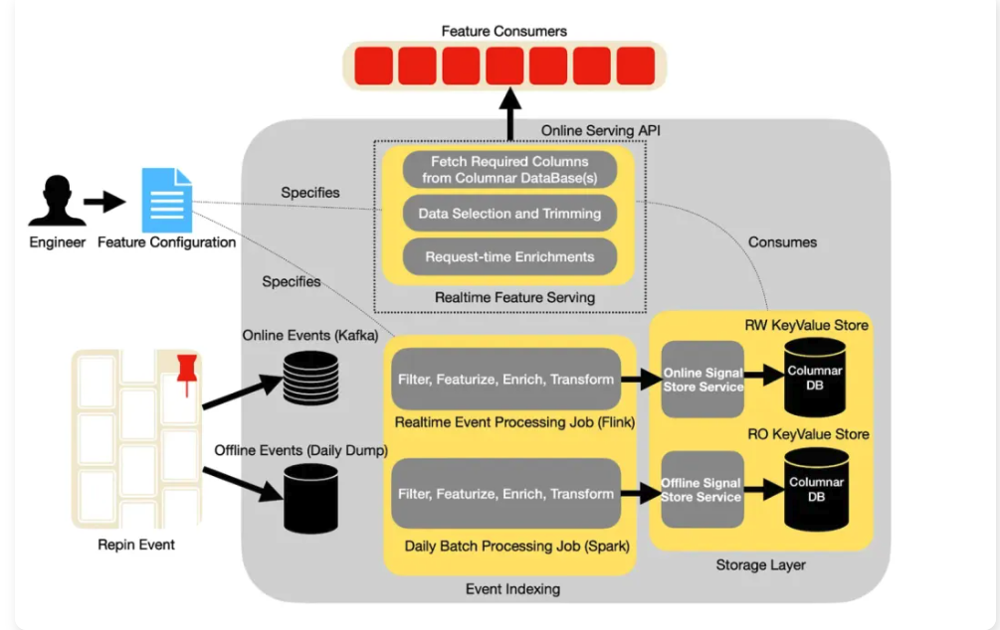

# Data Pipeline

Spark Structured Streaming and offline embedding jobs: ingest Kafka click and behavior events, join
impressions with feedback into feature+label training samples, train Item2Vec and ALS embeddings
from historical ratings, and keep per-user history and global item popularity fresh in Redis.



*Reference feature-store architecture: online events (Kafka) and offline events flow through a
filter → featurize → enrich → transform job into an online/offline signal store that the serving
API consumes. This repo implements the realtime path with **Spark Structured Streaming** (not the
Flink shown above) and uses Redis as the online signal store.*

## Data Flow

```text
── Streaming features ───────────────────────────────────────────────────────────────────────

producer.py ──(user_id key)──► Kafka: user_events ──► UserEventStreamingJob ──► Redis user:{id}:recent  (TTL 7d)
                                                                              └──► Redis global:item_popularity

producer.py ──(request_id key)► Kafka: behavior_logs ──► OnlineJoinerStreamingJob ──► Kafka: training_samples
                                                                                   └──► Parquet training-samples/date=YYYY-MM-DD/

Kafka: training_samples     ──► ExperienceCollectorStreamingJob  ──► Kafka: training_experiences
Kafka: training_experiences ──► RecommendationResponseStatsJob   ──► Kafka: recommendation_metrics
Kafka: movielens_context    ──► MovieLensContextCollectorStreamingJob ──► Redis user/movie context

── Offline embeddings ───────────────────────────────────────────────────────────────────────

ratings.csv ──► ItemSequencePreprocessingJob ──► Item2VecTrainingJob ──► embedding.txt
                                                                     └──► Redis i2vEmb:{item}

ratings.csv + embedding.txt ──► UserEmbeddingTrainingJob ──► user_embedding.txt
ratings.csv                 ──► AlsEmbeddingTrainingJob  ──► als/userFactors + als/itemFactors

user_embedding.txt + item_embedding.txt ──► EmbeddingCandidateGenerationJob ──► Redis user:{id}:candidates  (top-K cosine)
                                                                             └──► Parquet candidate-generation/
```

## Derived ML Datasets

All three jobs below consume `training_samples` (the OnlineJoiner output, which now carries
`session_id` end-to-end) and emit one row per recommended impression to a new Kafka topic. They
are additive — no existing topic/schema changed — and run standalone via `run-streaming-job.sh`.

```text
Kafka: training_samples ──► RecallSampleStreamingJob     ──► Kafka: recall_samples
Kafka: training_samples ──► RankingSampleStreamingJob    ──► Kafka: ranking_samples     (+ Redis uEmb/i2vEmb)
Kafka: training_samples ──► RelevanceSampleStreamingJob  ──► Kafka: relevance_samples   (+ Redis movie:{id}:features)
```

| Job | Topic | Row schema |
|---|---|---|
| `RecallSampleStreamingJob` | `recall_samples` | `user_id`, `session_id`, `event_ts`, `recommended_movie_id`, `click_movie_id` (null unless clicked), `rating` (label) |
| `RankingSampleStreamingJob` | `ranking_samples` | + `user_features`/`item_features` maps, `user_embedding` (`uEmb:{user}`), `item_embedding` (`i2vEmb:{item}`), `is_click`, `rating` |
| `RelevanceSampleStreamingJob` | `relevance_samples` | LTR shape: `query` (`user_id:session_id`), `recommended_movie_id`, `title`/`genres`/`release_year` (from `movie:{id}:features`), `score` (label) |

`rating`/`score` is the implicit engagement label (click → 1.0, order → 2.0, else 0.0). The ranking
and relevance jobs join Redis per micro-batch (embeddings / movie metadata); missing keys yield an
empty vector / null fields. Env knobs: `{RECALL,RANKING,RELEVANCE}_INPUT_TOPIC` (default
`training_samples`), `{RECALL,RANKING,RELEVANCE}_OUTPUT_TOPIC`, and (ranking) `USER_EMBEDDING_PREFIX`
/ `ITEM_EMBEDDING_PREFIX`.

```bash
SPARK_MAIN_CLASS=com.demo.process.RankingSampleStreamingJob ./run-streaming-job.sh
```

## Spark Job Package Structure

| Package | Responsibility | Examples |
|---|---|---|
| `com.demo.process` | Transform, join, and label stream/batch data into training samples; derive recall/ranking/relevance datasets | `OnlineJoinerStreamingJob`, `ExperienceCollectorStreamingJob`, `RecommendationResponseStatsJob`, `MovieLensContextCollectorStreamingJob`, `RecallSampleStreamingJob`, `RankingSampleStreamingJob`, `RelevanceSampleStreamingJob`, `ItemSequencePreprocessingJob` |
| `com.demo.task` | Runnable entry points for streaming ingestion and offline embedding training | `UserEventStreamingJob`, `Item2VecTrainingJob`, `UserEmbeddingTrainingJob`, `AlsEmbeddingTrainingJob` |
| `com.demo.recommend` | Offline candidate pre-computation from trained embeddings | `EmbeddingCandidateGenerationJob` |
| `com.demo.sink` | External write helpers | `RedisWriter` |
| `com.demo.util` | Shared Spark session and environment utilities | `Env`, `SparkSessions` |

## Real-Time Path

### `services/python-modeling/producer.py`

Publishes synthetic events to Kafka. In `clickstream` mode it writes simple click events keyed by `user_id`. In `behavior` mode it writes full impression/click/order slates keyed by `request_id`, which co-partitions all events in the same slate for the `OnlineJoinerStreamingJob` join. It uses lz4 compression; the event loop accounts for send latency so the configured rate is maintained accurately at high throughput.

Environment variables:

| Env var | Default | Description |
|---|---|---|
| `KAFKA_BOOTSTRAP_SERVERS` | `localhost:9092` | Kafka broker address |
| `KAFKA_TOPIC` | `user_events` | Kafka topic to publish to |
| `PRODUCER_MODE` | `clickstream` | `clickstream` emits single click events keyed by `user_id`; `behavior` emits full impression/click/order slates keyed by `request_id` |
| `EVENTS_PER_SECOND` | `1` | Target publish rate; the event loop corrects for send latency |
| `NUM_USERS` | `5` | Synthetic user pool size |
| `NUM_ITEMS` | `10` | Synthetic item pool size |
| `SLATE_SIZE` | `5` | Items per slate in `behavior` mode |
| `LOG_EVERY` | `100` | Log a summary line every N events |
| `MAX_EVENTS` | `0` | Stop after N events; `0` runs indefinitely |

`clickstream` mode event schema:

```json
{"user_id":"user_1","item_id":"item_3","event_type":"click","timestamp":1713600001}
```

`behavior` mode event schema:

```json
{
  "request_id": "req_abc123",
  "user_id": "user_1",
  "item_id": "item_3",
  "event_type": "impression",
  "timestamp": 1713600001,
  "position": 0,
  "user_features": {"tier": "vip"},
  "item_features": {"bucket": "b1"},
  "context_features": {"device": "ios", "country": "US"}
}
```

### `UserEventStreamingJob`

Consumes click events from Kafka and writes user click history and item popularity to Redis. Connection pooling uses a per-executor `JedisPool` (one pool per JVM, reused across micro-batches) rather than a new TCP connection per partition.

For each micro-batch, it:

1. Aggregates clicked items per user in a single pass.
2. Writes one `LPUSH` + `LTRIM` + `EXPIRE` per user to `user:{id}:recent` (not one write per event).
3. Aggregates per-item click counts.
4. Writes one `ZINCRBY` per unique item to `global:item_popularity`.

Redis keys written:

| Key | Type | Contents | TTL |
|---|---|---|---|
| `user:{id}:recent` | list | Most recent clicked items, newest first | `RECENT_ITEMS_TTL_SECONDS` (default 7 days) |
| `global:item_popularity` | sorted set | Global click counts | none |

Environment variables:

| Env var | Default |
|---|---|
| `SPARK_APP_NAME` | `UserEventStreamingJob` |
| `SPARK_MASTER` | `local[*]` |
| `SPARK_SQL_SHUFFLE_PARTITIONS` | `4` |
| `KAFKA_BOOTSTRAP_SERVERS` | `localhost:9092` |
| `KAFKA_TOPIC` | `user_events` |
| `REDIS_HOST` | `localhost` |
| `REDIS_PORT` | `6379` |
| `RECENT_ITEMS_LIMIT` | `20` |
| `RECENT_ITEMS_TTL_SECONDS` | `604800` (7 days) |
| `REDIS_PIPELINE_SIZE` | `500` |
| `REDIS_POOL_MAX_TOTAL` | `8` |
| `MAX_OFFSETS_PER_TRIGGER` | `5000` |
| `TRIGGER_INTERVAL` | `5 seconds` |
| `SPARK_CHECKPOINT_LOCATION` | `/tmp/spark-recsys/user-event-streaming-job` |

### `OnlineJoinerStreamingJob`

Joins impression events with later feedback from Kafka to produce labeled training samples (features + label).

Start the behavior-mode producer:

```bash
PRODUCER_MODE=behavior KAFKA_TOPIC=behavior_logs python services/python-modeling/producer.py
```

Start the joiner job:

```bash
SPARK_MAIN_CLASS=com.demo.process.OnlineJoinerStreamingJob \
ONLINE_JOINER_INPUT_TOPIC=behavior_logs \
ONLINE_JOINER_OUTPUT_TOPIC=training_samples \
ONLINE_JOINER_HDFS_OUTPUT_PATH=/tmp/spark-recsys/training-samples \
./run-streaming-job.sh
```

For each micro-batch, it:

1. Runs a **single-pass conditional `groupBy`** over `(request_id, user_id, item_id)`: impression/exposure rows contribute position, timestamp, and feature fields; click/order/purchase rows contribute feedback signals. Replaces the previous double-filter + join pattern — one shuffle and one scan instead of two each.
2. Drops groups with no impression in this batch (`impression_ts IS NULL`) — pure late-feedback events with no matching slate exposure.
3. Produces one sample per exposed item with `clicked`, `ordered`, and numeric `label` (`0.0` = not clicked, `1.0` = clicked, `2.0` = ordered).
4. Persists the joined samples (`MEMORY_AND_DISK_SER`) and writes to both sinks inside a `try/finally` that always unpersists.
5. Writes samples to Kafka for online model updates.
6. Writes samples to Parquet **partitioned by date** (`date=YYYY-MM-DD/`) for efficient incremental reads by downstream training jobs.

Environment variables:

| Env var | Default |
|---|---|
| `SPARK_APP_NAME` | `OnlineJoinerStreamingJob` |
| `ONLINE_JOINER_INPUT_TOPIC` | `behavior_logs` |
| `ONLINE_JOINER_OUTPUT_TOPIC` | `training_samples` |
| `ONLINE_JOINER_HDFS_OUTPUT_PATH` | `/tmp/spark-recsys/training-samples` |
| `SPARK_CHECKPOINT_LOCATION` | `/tmp/spark-recsys/online-joiner` |

### Session tracking

Each behavior slate carries a `session_id` (producers group 1..`SESSION_MAX_SLATES` slates per user
into a session). `OnlineJoinerStreamingJob` threads it through to `training_samples` (Kafka value +
Parquet), and `ExperienceCollectorStreamingJob` carries it into `training_experiences`. It is
additive and nullable. `SessionReportJob` (Scala) aggregates session-level
engagement (sessions/user, slates/session, clicks/session, session CTR) from the Parquet.

### Event de-duplication (Phase 2)

`UserEventStreamingJob` and
`OnlineJoinerStreamingJob` drop duplicate `event_id`s within
`EVENT_WATERMARK_DELAY` (default `10 minutes`). Because this makes the queries
stateful, **existing checkpoints are incompatible** — on first deploy of this
change, point `SPARK_CHECKPOINT_LOCATION` at a fresh directory. Per-batch
`corrupt=<n>` counts are logged by the metrics listener.

### `ExperienceCollectorStreamingJob`

Consumes item-level training samples from Kafka and rebuilds each recommendation request as a list-level slate experience.

```bash
SPARK_MAIN_CLASS=com.demo.process.ExperienceCollectorStreamingJob \
EXPERIENCE_COLLECTOR_INPUT_TOPIC=training_samples \
EXPERIENCE_COLLECTOR_OUTPUT_TOPIC=training_experiences \
./run-streaming-job.sh
```

For each micro-batch, it groups samples by `(request_id, user_id)`, sorts items by `position`, and emits a slate JSON containing request context, item features, item labels, slate size, and aggregate slate reward.

Environment variables:

| Env var | Default |
|---|---|
| `SPARK_APP_NAME` | `ExperienceCollectorStreamingJob` |
| `EXPERIENCE_COLLECTOR_INPUT_TOPIC` | `training_samples` |
| `EXPERIENCE_COLLECTOR_OUTPUT_TOPIC` | `training_experiences` |
| `SPARK_CHECKPOINT_LOCATION` | `/tmp/spark-recsys/experience-collector` |

### `RecommendationResponseStatsJob`

Consumes request-level slates from `training_experiences` and emits global response metric events to Kafka. Per response, the job produces a total counter, a country-bucketed total counter, selected item/ad counts, and guardrail checks for empty or insufficiently populated responses.

```bash
SPARK_MAIN_CLASS=com.demo.process.RecommendationResponseStatsJob \
RESPONSE_STATS_INPUT_TOPIC=training_experiences \
RESPONSE_STATS_OUTPUT_TOPIC=recommendation_metrics \
./run-streaming-job.sh
```

Each metric payload contains:

| Field | Value |
|---|---|
| `metric_name` | `RecommendationFeed.response` |
| `tags` | `type`, `subscription`, optional `country`, optional `blender`, optional `stage` |
| `value` | Count for that response/stat |

Tag sources:

| Tag | Source field(s) | Notes |
|---|---|---|
| `type` | `item_features.type` or `item_features.product_type` | `ad`, `ads`, `sponsored` → ad; all others → item |
| `subscription` | `user_features.subscription_level` or `user_features.subscription` | |
| `country` | Context/user country fields | Bucketed |
| `blender` | `context_features.AdsBlenderType` or `context_features.ads_blender_type` | Optional |

Environment variables:

| Env var | Default |
|---|---|
| `SPARK_APP_NAME` | `RecommendationResponseStatsJob` |
| `RESPONSE_STATS_INPUT_TOPIC` | `training_experiences` |
| `RESPONSE_STATS_OUTPUT_TOPIC` | `recommendation_metrics` |
| `SPARK_CHECKPOINT_LOCATION` | `/tmp/spark-recsys/response-stats` |

### `MovieLensContextCollectorStreamingJob`

Consumes MovieLens user, movie, and rating context updates from Kafka and writes the Redis hashes used by the retrieval service query hydrators. Context events are normalized once in the streaming layer; the online service then reads compact per-user and per-movie feature state at request time.

```bash
SPARK_MAIN_CLASS=com.demo.process.MovieLensContextCollectorStreamingJob \
MOVIELENS_CONTEXT_INPUT_TOPIC=movielens_context \
./run-streaming-job.sh
```

For each micro-batch, it:

1. Classifies mixed JSON records as `user_update`, `movie_update`, or `rating`.
2. Merges user demographic fields and rating aggregates (`avgRating`, `ratingCount`, `recentlyRatedMovieIds`, `actionSequenceMovieIds`) into `user:{id}:features`.
3. Stores movie title, genres, and release year under `movie:{id}:features`.

Redis keys written:

| Key | Type | Contents | TTL |
|---|---|---|---|
| `user:{id}:features` | hash | MovieLens user demographics and rating context | `MOVIELENS_CONTEXT_TTL_SECONDS` (default 30 days) |
| `movie:{id}:features` | hash | Movie title, genres, release year | `MOVIELENS_CONTEXT_TTL_SECONDS` (default 30 days) |

Environment variables:

| Env var | Default |
|---|---|
| `SPARK_APP_NAME` | `MovieLensContextCollectorStreamingJob` |
| `MOVIELENS_CONTEXT_INPUT_TOPIC` | `movielens_context` |
| `REDIS_HOST` | `localhost` |
| `REDIS_PORT` | `6379` |
| `MOVIELENS_CONTEXT_TTL_SECONDS` | `2592000` (30 days) |
| `MOVIELENS_RECENT_RATINGS_LIMIT` | `50` |
| `REDIS_PIPELINE_SIZE` | `500` |
| `REDIS_POOL_MAX_TOTAL` | `8` |
| `MAX_OFFSETS_PER_TRIGGER` | `5000` |
| `TRIGGER_INTERVAL` | `10 seconds` |
| `SPARK_CHECKPOINT_LOCATION` | `/tmp/spark-recsys/movielens-context-collector` |

## Offline Path

### `ItemSequencePreprocessingJob`

Builds time-ordered item sequences from ratings where `rating >= 3.5`.

```bash
spark-submit \
  --class com.demo.process.ItemSequencePreprocessingJob \
  services/spark-streaming-job/target/scala-2.12/spark-recsys-job.jar \
  sampledata/ratings.csv \
  /tmp/spark-recsys/item-sequences
```

Environment variables:

| Env var | Description |
|---|---|
| `RATINGS_INPUT_PATH` | Path to the ratings CSV; overrides the first positional argument |
| `ITEM_SEQUENCES_OUTPUT_PATH` | Output directory for item sequences; overrides the second positional argument |

### `Item2VecTrainingJob`

Trains Spark MLlib `Word2Vec` on item sequences, writes item embeddings to a text file, and optionally publishes them to Redis for the retrieval service.

```bash
spark-submit \
  --class com.demo.task.Item2VecTrainingJob \
  services/spark-streaming-job/target/scala-2.12/spark-recsys-job.jar \
  sampledata/ratings.csv \
  sampledata/embedding.txt \
  item_1
```

Key environment variables:

| Env var | Default |
|---|---|
| `RATINGS_INPUT_PATH` | *(positional arg)* |
| `ITEM2VEC_EMBEDDING_PATH` | `recsys-pipeline/sampledata/embedding.txt` |
| `ITEM2VEC_QUERY_ITEM` | `592` |
| `ITEM2VEC_REDIS_KEY_PREFIX` | `i2vEmb` |
| `ITEM2VEC_REDIS_TTL_SECONDS` | `86400` (1 day) |
| `ITEM2VEC_MIN_COUNT` | `1` |
| `ITEM2VEC_SAVE_TO_REDIS` | `false` |

Train and publish embeddings to Redis:

```bash
ITEM2VEC_SAVE_TO_REDIS=true \
REDIS_HOST=localhost \
REDIS_PORT=6379 \
spark-submit \
  --class com.demo.task.Item2VecTrainingJob \
  services/spark-streaming-job/target/scala-2.12/spark-recsys-job.jar \
  sampledata/ratings.csv \
  sampledata/embedding.txt \
  item_1
```

Output format:

```text
item_1:0.0123 -0.4567 0.8910 ...
```

### `UserEmbeddingTrainingJob`

Builds a user embedding by averaging item vectors for ratings at or above `USER_EMBEDDING_MIN_RATING` (default `3.5`).

```bash
spark-submit \
  --class com.demo.task.UserEmbeddingTrainingJob \
  services/spark-streaming-job/target/scala-2.12/spark-recsys-job.jar \
  sampledata/ratings.csv \
  sampledata/item_embedding_sample.txt \
  sampledata/user_embedding.txt
```

Key environment variables:

| Env var | Default |
|---|---|
| `RATINGS_INPUT_PATH` | *(positional arg)* |
| `ITEM2VEC_EMBEDDING_PATH` | *(positional arg)* |
| `USER_EMBEDDING_OUTPUT_PATH` | `recsys-pipeline/sampledata/user_embedding.txt` |
| `USER_EMBEDDING_MIN_RATING` | `3.5` |

Output format:

```text
user_1:0.9 0.1 0.0
```

### `AlsEmbeddingTrainingJob`

Trains Spark ML ALS collaborative filtering on the ratings matrix and writes latent user and item factors.

```bash
spark-submit \
  --class com.demo.task.AlsEmbeddingTrainingJob \
  services/spark-streaming-job/target/scala-2.12/spark-recsys-job.jar \
  sampledata/ratings.csv \
  sampledata/als
```

Key environment variables:

| Env var | Default |
|---|---|
| `RATINGS_INPUT_PATH` | *(positional arg)* |
| `ALS_EMBEDDING_OUTPUT_PATH` | `recsys-pipeline/sampledata/als` |
| `ALS_RANK` | `16` |
| `ALS_MAX_ITER` | `10` |
| `ALS_REG_PARAM` | `0.1` |

Output paths:

```text
sampledata/als/userFactors/part-...
sampledata/als/itemFactors/part-...
```

### `EmbeddingCandidateGenerationJob`

Pre-computes top-K candidates per user in batch. Loads pre-trained user and item embeddings (output of `UserEmbeddingTrainingJob` or `AlsEmbeddingTrainingJob`), broadcasts the full item catalog to every executor, and computes cosine similarity locally per user partition with no cross-join or shuffle. Writes results to Parquet and optionally to Redis.

```bash
spark-submit \
  --class com.demo.recommend.EmbeddingCandidateGenerationJob \
  services/spark-streaming-job/target/scala-2.12/spark-recsys-job.jar \
  sampledata/user_embedding.txt \
  sampledata/embedding.txt \
  sampledata/candidates
```

Key environment variables:

| Env var | Default |
|---|---|
| `USER_EMBEDDING_PATH` | *(positional arg)* |
| `ITEM_EMBEDDING_PATH` | *(positional arg)* |
| `CANDIDATE_OUTPUT_PATH` | *(positional arg)* |
| `CANDIDATE_TOP_K` | `100` |
| `CANDIDATE_SAVE_TO_REDIS` | `false` |
| `CANDIDATE_REDIS_KEY_PREFIX` | `user` (writes `user:{id}:candidates`) |
| `CANDIDATE_REDIS_TTL_SECONDS` | `86400` (1 day) |
